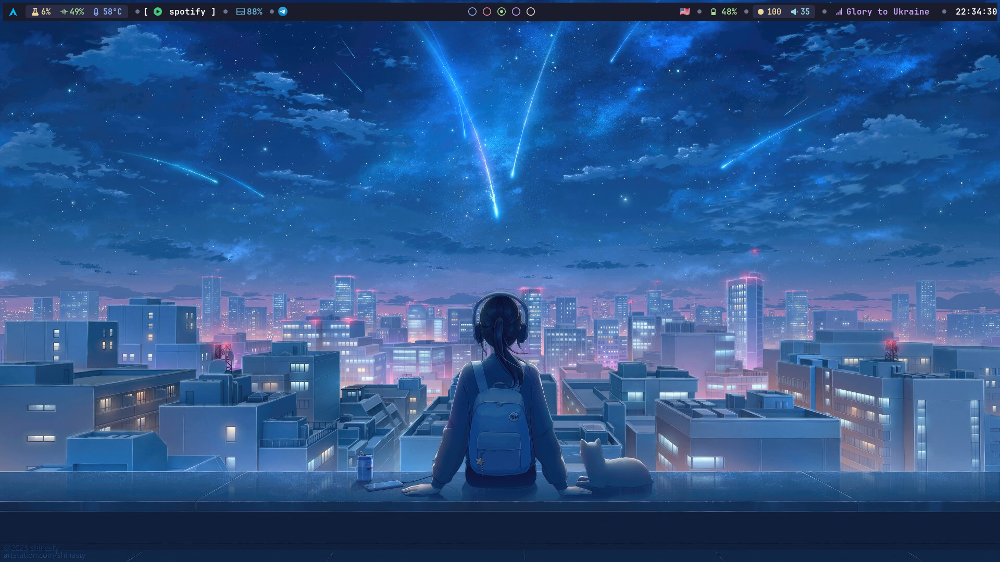

  
# 💻 Hyprland Dotfiles 💻

## Lockscreen

## Apply Config
**The script is supported for Arch Linux only.**  
To use it, you just need to enter the command `bash customize.sh`.  
*Note: all your previous configuration files will be saved in the `~/.config/old_config` dir*.

### Acknowledgements
Thanks for help with setup
[SoappGuy](https://github.com/SoappGuy) and [Qmlnt](https://github.com/Qmlnt)  

### Supporting resources  
[waybar and kitty](https://github.com/knightfallxz/Hyprland-config)  
[hyprlock](https://github.com/FireDrop6000/hyprland-mydots)
